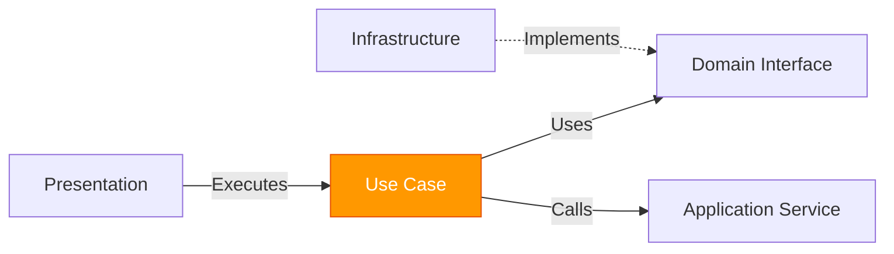

The Application Layer orchestrates business workflows by coordinating domain entities and external services. It contains use cases that represent specific user actions and application-level services.

## Layer Overview

**Location**: `~/workspace/source/Chapi/Application/`

**Responsibilities**:
- Implement use cases (user stories)
- Orchestrate domain entities and services
- Define application-specific interfaces
- Coordinate transactions and workflows
- Transform data between layers

**Dependencies**: 
- ✅ Depends on Domain Layer (entities, interfaces)
- ❌ No dependencies on Infrastructure or Presentation

## Architecture Pattern

Chapi uses the **Use Case pattern** to organize application logic:



## Use Cases

Use cases represent single user actions or business operations.

### Git Use Cases

<Expandable title="CommitChangesUseCase">
  Orchestrates the commit workflow with validation and notifications.

  ```csharp
  namespace Chapi.Application.UseCases.Git;

  public class CommitRequest
  {
      public string ProjectPath { get; set; } = string.Empty;
      public string Message { get; set; } = string.Empty;
      public IEnumerable<string> Files { get; set; } = Enumerable.Empty<string>();
  }

  public class CommitChangesUseCase
  {
      private readonly IGitRepository _gitRepo;
      private readonly INotificationService _notifications;

      public CommitChangesUseCase(
          IGitRepository gitRepo, 
          INotificationService notifications)
      {
          _gitRepo = gitRepo;
          _notifications = notifications;
      }

      public async Task<Result<GitCommit>> ExecuteAsync(CommitRequest request)
      {
          // 1. Validate
          var validation = Validate(request);
          if (!validation.IsSuccess)
          {
              _notifications.ShowWarning(validation.Error);
              return Result<GitCommit>.Fail(validation.Error);
          }

          // 2. Execute commit
          var result = await _gitRepo.CommitAsync(
              request.ProjectPath, 
              request.Message, 
              request.Files);

          // 3. Notify result
          if (result.IsSuccess)
          {
              _notifications.ShowSuccess($"Commit realizado: {request.Message}");
          }
          else
          {
              _notifications.ShowError($"Error al hacer commit: {result.Error}");
          }

          return result;
      }

      private Result Validate(CommitRequest request)
      {
          if (string.IsNullOrWhiteSpace(request.ProjectPath))
              return Result.Fail("Ruta de proyecto invalida");

          if (!Directory.Exists(request.ProjectPath))
              return Result.Fail("El proyecto no existe");

          if (string.IsNullOrWhiteSpace(request.Message))
              return Result.Fail("Debes escribir un mensaje de commit");

          if (!request.Files.Any())
              return Result.Fail("No hay archivos seleccionados para hacer commit");

          return Result.Success();
      }
  }
  ```

  **Workflow**:
  1. Validate request parameters
  2. Call domain repository
  3. Notify user of result
  4. Return result to caller

  **Source**: `Application/UseCases/Git/CommitChangesUseCase.cs`
</Expandable>

<Expandable title="LoadChangesUseCase">
  Retrieves uncommitted changes from the repository.

  ```csharp
  public class LoadChangesUseCase
  {
      private readonly IGitRepository _gitRepo;

      public async Task<IEnumerable<FileChange>> ExecuteAsync(string projectPath)
      {
          if (string.IsNullOrWhiteSpace(projectPath))
              return Enumerable.Empty<FileChange>();

          return await _gitRepo.GetChangesAsync(projectPath);
      }
  }
  ```

  **Source**: `Application/UseCases/Git/LoadChangesUseCase.cs`
</Expandable>

### Project Use Cases

<Expandable title="CreateProjectUseCase">
  Orchestrates project creation from template with multiple steps.

  ```csharp
  namespace Chapi.Application.UseCases.Projects;

  public record CreateProjectRequest(
      string ProjectName,
      string ParentDirectory,
      string TemplateUrl,
      string RemoteUrl = null
  );

  public class CreateProjectUseCase
  {
      private readonly IGitRepository _gitRepository;
      private readonly ITemplateService _templateService;
      private readonly IProjectRepository _projectRepository;

      public async Task<Result<string>> ExecuteAsync(
          CreateProjectRequest request, 
          Action<string> onProgress = null)
      {
          try
          {
              string targetPath = Path.Combine(
                  request.ParentDirectory, 
                  request.ProjectName);

              if (Directory.Exists(targetPath))
                  return Result<string>.Fail($"El directorio ya existe: {targetPath}");

              // 1. Clone template repository
              onProgress?.Invoke("Clonando repositorio base...");
              var cloneResult = await _gitRepository.CloneAsync(
                  request.TemplateUrl, 
                  targetPath);
              if (!cloneResult.IsSuccess) 
                  return Result<string>.Fail(cloneResult.Error);

              // 2. Remove original .git folder
              onProgress?.Invoke("Limpiando metadatos de Git...");
              string gitPath = Path.Combine(targetPath, ".git");
              if (Directory.Exists(gitPath))
                  DeleteDirectory(gitPath);

              // 3. Rename project structure
              onProgress?.Invoke("Personalizando estructura del proyecto...");
              string oldName = Path.GetFileNameWithoutExtension(request.TemplateUrl);
              var renameResult = await _templateService.RenameTemplateAsync(
                  targetPath, oldName, request.ProjectName, onProgress);
              if (!renameResult.IsSuccess) 
                  return Result<string>.Fail(renameResult.Error);

              // 4. Initialize new Git repository
              onProgress?.Invoke("Inicializando nuevo repositorio Git...");
              var initResult = await _gitRepository.InitAsync(targetPath);
              if (!initResult.IsSuccess) 
                  return Result<string>.Fail(initResult.Error);

              // 5. Associate remote if provided
              if (!string.IsNullOrWhiteSpace(request.RemoteUrl))
              {
                  onProgress?.Invoke("Asociando repositorio remoto...");
                  await _gitRepository.AddRemoteAsync(
                      targetPath, "origin", request.RemoteUrl);
              }

              // 6. Register project
              onProgress?.Invoke("Registrando proyecto en Chapi...");
              await _projectRepository.AddProjectAsync(targetPath);

              return Result<string>.Success(targetPath);
          }
          catch (Exception ex)
          {
              return Result<string>.Fail($"Error fatal: {ex.Message}");
          }
      }
  }
  ```

  **Complex Workflow**:
  - Multi-step process with progress reporting
  - Coordinates Git, Template, and Project services
  - Handles cleanup on failure
  - Returns path to newly created project

  **Source**: `Application/UseCases/Projects/CreateProjectUseCase.cs`
</Expandable>

### AI Use Cases

<Expandable title="GenerateCommitMessageUseCase">
  Uses AI to generate semantic commit messages from diffs.

  ```csharp
  public class GenerateCommitMessageUseCase
  {
      private readonly IChatClient _chatClient;

      public async Task<Result<string>> ExecuteAsync(string diff)
      {
          if (string.IsNullOrWhiteSpace(diff))
              return Result<string>.Fail("No hay cambios para analizar");

          try
          {
              var prompt = GetPrompt.CommitMessage(diff);
              var messages = new[] { 
                  new ChatMessage(ChatRole.User, prompt) 
              };

              var response = await _chatClient.GetResponseAsync(messages);
              var responseText = response.Messages.FirstOrDefault()?.Text;

              if (string.IsNullOrWhiteSpace(responseText))
                  return Result<string>.Fail("No se recibió respuesta de la IA");

              return Result<string>.Success(responseText);
          }
          catch (Exception ex)
          {
              return Result<string>.Fail($"Error al generar mensaje: {ex.Message}");
          }
      }
  }
  ```

  **Source**: `Application/UseCases/AI/GenerateCommitMessageUseCase.cs`
</Expandable>

## Application Services

Application services provide cross-cutting functionality for use cases.

<Expandable title="GeminiChatService">
  Intelligent chat service with context awareness and streaming.

  ```csharp
  namespace Chapi.Application.Services.Assistant;

  public class GeminiChatService
  {
      private readonly IAssistantCapabilityRegistry _capabilityRegistry;
      private readonly IServiceProvider _serviceProvider;

      public async Task<Result<string>> SendMessageAsync(
          string userMessage, 
          ConversationContext context,
          Action<string>? onTokenReceived = null)
      {
          try
          {
              var contextInfo = BuildContextInfo(context);
              var conversationHistory = BuildConversationHistory(context);
              var capabilitiesInfo = BuildCapabilitiesInfo();
              
              var fullPrompt = GetPrompt.ChatAssistant(
                  contextInfo, 
                  conversationHistory, 
                  capabilitiesInfo, 
                  userMessage);

              var chatClient = _serviceProvider.GetRequiredService<IChatClient>();
              var messages = new List<ChatMessage> { 
                  new ChatMessage(ChatRole.User, fullPrompt) 
              };
              
              var fullResponseBuilder = new StringBuilder();
              
              // Streaming response
              await foreach (var update in chatClient.GetStreamingResponseAsync(messages))
              {
                  if (update.Contents.Count > 0 && 
                      update.Contents[0] is TextContent textContent && 
                      textContent.Text != null)
                  {
                      var token = textContent.Text;
                      fullResponseBuilder.Append(token);
                      onTokenReceived?.Invoke(token);
                  }
              }

              var responseText = fullResponseBuilder.ToString();
              return Result<string>.Success(responseText);
          }
          catch (Exception ex)
          {
              return Result<string>.Fail($"Error al comunicarse con la IA: {ex.Message}");
          }
      }

      private string BuildContextInfo(ConversationContext context)
      {
          if (context.CurrentProject == null)
              return "⚠️ No hay proyecto seleccionado actualmente";

          var sb = new StringBuilder();
          sb.AppendLine("=== CONTEXTO DEL PROYECTO ACTUAL ===");
          sb.AppendLine($"📁 Proyecto: {context.CurrentProject.Name}");
          sb.AppendLine($"🔧 Tecnología: {context.CurrentProject.Technology}");
          
          // Add Git context
          if (context.CurrentProject.Git != null)
          {
              var git = context.CurrentProject.Git;
              sb.AppendLine($"🌿 Branch actual: {git.CurrentBranch}");
              sb.AppendLine($"⚠️ Cambios sin commitear: {git.ModifiedFiles.Count}");
          }

          return sb.ToString();
      }
  }
  ```

  **Features**:
  - Context-aware prompts with project information
  - Streaming token support for real-time UI updates
  - Capability registry for extensible actions
  - Conversation history management

  **Source**: `Application/Services/Assistant/GeminiChatService.cs`
</Expandable>

<Expandable title="ProjectContextBuilder">
  Builds comprehensive project context for AI assistant.

  ```csharp
  public class ProjectContextBuilder
  {
      public async Task<ProjectContext> BuildAsync(string projectPath)
      {
          var context = new ProjectContext
          {
              Path = projectPath,
              Name = Path.GetFileName(projectPath),
              Technology = DetectTechnology(projectPath),
              MainFolders = GetMainFolders(projectPath),
              RecentFiles = await GetRecentFilesAsync(projectPath),
              Git = await BuildGitContextAsync(projectPath)
          };

          return context;
      }

      private string DetectTechnology(string projectPath)
      {
          if (Directory.GetFiles(projectPath, "*.csproj").Any())
              return ".NET";
          if (Directory.GetFiles(projectPath, "package.json").Any())
              return "Node.js";
          return "Unknown";
      }
  }
  ```

  **Source**: `Application/Services/Assistant/ProjectContextBuilder.cs`
</Expandable>

## Application Interfaces

Interfaces defined at the application level for infrastructure to implement.

```csharp
namespace Chapi.Application.Interfaces.Workspace;

public interface IWorkspaceService
{
    Task<Result<WorkspaceData>> LoadWorkspaceAsync(string projectPath);
    Task<Result> SaveWorkspaceAsync(WorkspaceData data);
    Task<Result<string>> GetRandomQuoteAsync();
    Result OpenFileInExplorer(string filePath);
}
```

**Source**: `Application/Interfaces/Workspace/IWorkspaceService.cs`

## Use Case Categories

<CardGroup cols={2}>
  <Card title="Git Operations" icon="git-alt">
    - CommitChangesUseCase
    - PushChangesUseCase
    - LoadHistoryUseCase
    - SwitchBranchUseCase
    - StashChangesUseCase
  </Card>
  <Card title="Project Management" icon="folder">
    - CreateProjectUseCase
    - LoadProjectsUseCase
    - SwitchProjectUseCase
    - DeployProjectReleaseUseCase
  </Card>
  <Card title="AI Features" icon="brain">
    - SendChatMessageUseCase
    - GenerateCommitMessageUseCase
    - GenerateSqlQueryUseCase
  </Card>
  <Card title="Code Generation" icon="code">
    - GenerateModuleUseCase
    - AddApiControllerUseCase
    - AddDependencyInjectionUseCase
  </Card>
</CardGroup>

## Dependency Injection

Use cases are registered as transient services:

```csharp
services.AddTransient<CommitChangesUseCase>();
services.AddTransient<CreateProjectUseCase>();
services.AddTransient<GenerateCommitMessageUseCase>();

services.AddSingleton<GeminiChatService>();
services.AddSingleton<IAssistantCapabilityRegistry, AssistantCapabilityRegistry>();
```

## Request/Response Pattern

Many use cases follow a Request/Response pattern:

```csharp
// Request object
public record CreateProjectRequest(
    string ProjectName,
    string ParentDirectory,
    string TemplateUrl,
    string RemoteUrl = null
);

// Use case execution
var request = new CreateProjectRequest(
    "MyApp",
    "C:/Projects",
    "https://github.com/template/repo"
);

var result = await _createProjectUseCase.ExecuteAsync(
    request, 
    progress => Console.WriteLine(progress)
);
```

**Benefits**:
- Type-safe parameters
- Immutable requests (using records)
- Easy to test
- Self-documenting API

## Testing Use Cases

```csharp
[Test]
public async Task CommitChanges_ShouldFail_WhenNoFilesSelected()
{
    // Arrange
    var mockGitRepo = new Mock<IGitRepository>();
    var mockNotifications = new Mock<INotificationService>();
    var useCase = new CommitChangesUseCase(mockGitRepo.Object, mockNotifications.Object);

    var request = new CommitRequest
    {
        ProjectPath = "/valid/path",
        Message = "Test commit",
        Files = Enumerable.Empty<string>()
    };

    // Act
    var result = await useCase.ExecuteAsync(request);

    // Assert
    Assert.IsFalse(result.IsSuccess);
    Assert.AreEqual("No hay archivos seleccionados para hacer commit", result.Error);
    mockNotifications.Verify(n => n.ShowWarning(It.IsAny<string>()), Times.Once);
}
```

## Best Practices

<AccordionGroup>
  <Accordion title="Single Responsibility">
    Each use case handles **one** user action or business operation.
  </Accordion>

  <Accordion title="Validation First">
    Always validate inputs before calling domain services:
    ```csharp
    var validation = Validate(request);
    if (!validation.IsSuccess)
        return Result.Fail(validation.Error);
    ```
  </Accordion>

  <Accordion title="Progress Reporting">
    For long-running operations, provide progress callbacks:
    ```csharp
    public async Task<Result<string>> ExecuteAsync(
        CreateProjectRequest request, 
        Action<string> onProgress = null)
    {
        onProgress?.Invoke("Step 1...");
        // ...
        onProgress?.Invoke("Step 2...");
    }
    ```
  </Accordion>

  <Accordion title="Use Result Pattern">
    Return `Result<T>` instead of throwing exceptions for expected failures.
  </Accordion>
</AccordionGroup>

## Related Documentation

<CardGroup cols={3}>
  <Card title="Domain Layer" href="/architecture/domain-layer" icon="cube">
    Core entities and interfaces
  </Card>
  <Card title="Infrastructure Layer" href="/architecture/infrastructure-layer" icon="server">
    Implementation of services
  </Card>
  <Card title="Presentation Layer" href="/architecture/presentation-layer" icon="desktop">
    ViewModels consuming use cases
  </Card>
</CardGroup>