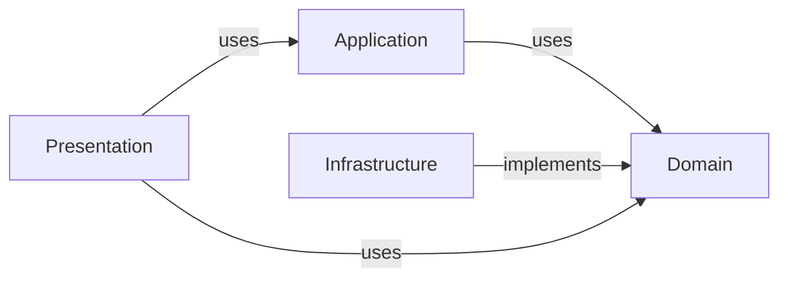
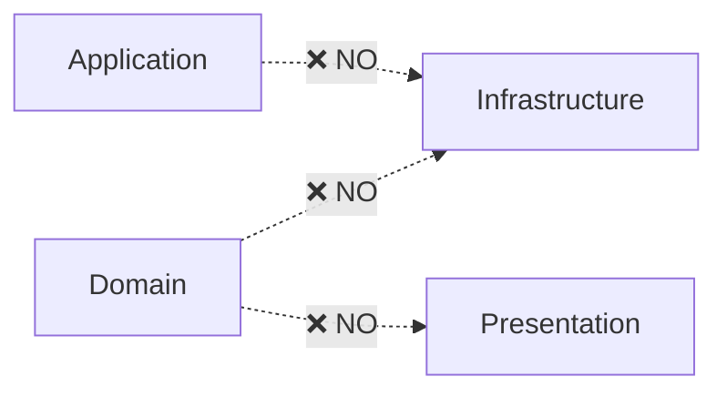

## What is Clean Architecture?

Clean Architecture is a software design philosophy created by Robert C. Martin (Uncle Bob) that emphasizes separation of concerns and independence of frameworks, UI, databases, and external agencies.

## Core Principles

### 1. Independence

The architecture is independent of:

- **Frameworks**: The architecture doesn't depend on WPF, LibGit2Sharp, or other libraries
- **UI**: Business logic works without any UI
- **Database**: Domain logic doesn't care about storage mechanisms
- **External Services**: Core business rules don't depend on external APIs

### 2. Testability

Business rules can be tested without:
- UI
- Database
- Web server
- External dependencies

### 3. The Dependency Rule

> **Dependencies must point inward toward the Domain**

Source code dependencies can only point inward. Inner circles cannot know anything about outer circles.

```
┌───────────────────────────────────┐
│     Presentation Layer            │  Depends on →
├───────────────────────────────────┤
│     Application Layer             │  Depends on →
├───────────────────────────────────┤
│     Domain Layer (Core)           │  ← Independent
├───────────────────────────────────┤
│     Infrastructure Layer          │  Depends on →
└───────────────────────────────────┘
```

## The Four Layers

### Domain Layer (Core)

**Location**: `Chapi/Domain/`

**Purpose**: Contains the core business entities, rules, and abstractions

**Responsibilities**:
- Define business entities (`GitCommit`, `FileChange`, `Project`)
- Define domain interfaces (`IGitRepository`, `INotificationService`)
- Contain business rules and validations
- Define value objects and enumerations

**Key Characteristics**:
- No dependencies on other layers
- No references to external libraries (except .NET base classes)
- Pure business logic

**Example**:
```csharp
namespace Chapi.Domain.Entities;

public class GitCommit
{
    public string Hash { get; set; }
    public string Author { get; set; }
    public string Message { get; set; }
    public DateTime Date { get; set; }
    
    public bool IsValid() => 
        !string.IsNullOrWhiteSpace(Hash) && 
        !string.IsNullOrWhiteSpace(Message);
}
```

### Application Layer (Use Cases)

**Location**: `Chapi/Application/`

**Purpose**: Contains application-specific business rules and orchestrates data flow

**Responsibilities**:
- Implement Use Cases (business operations)
- Coordinate between Domain and Infrastructure
- Transform data between layers
- Enforce business workflows

**Dependencies**:
- Can depend on Domain layer
- Uses Domain interfaces
- Independent of UI and Infrastructure implementations

**Example**:
```csharp
namespace Chapi.Application.UseCases.Git;

public class CommitChangesUseCase
{
    private readonly IGitRepository _gitRepo;
    private readonly INotificationService _notifications;
    
    public CommitChangesUseCase(
        IGitRepository gitRepo, 
        INotificationService notifications)
    {
        _gitRepo = gitRepo;
        _notifications = notifications;
    }
    
    public async Task<Result<GitCommit>> ExecuteAsync(CommitRequest request)
    {
        // 1. Validate
        var validation = Validate(request);
        if (!validation.IsSuccess)
            return Result<GitCommit>.Fail(validation.Error);
        
        // 2. Execute operation
        var result = await _gitRepo.CommitAsync(
            request.ProjectPath, 
            request.Message, 
            request.Files);
        
        // 3. Notify user
        if (result.IsSuccess)
            _notifications.ShowSuccess($"Commit: {request.Message}");
        else
            _notifications.ShowError(result.Error);
        
        return result;
    }
}
```

### Infrastructure Layer

**Location**: `Chapi/Infrastructure/`

**Purpose**: Implements interfaces defined in Domain layer using external libraries and services

**Responsibilities**:
- Implement repository interfaces
- Handle external API calls (Git, AI services)
- Manage file system operations
- Handle persistence and caching

**Dependencies**:
- Depends on Domain layer (implements its interfaces)
- Can use external libraries (LibGit2Sharp, HTTP clients, etc.)

**Example**:
```csharp
namespace Chapi.Infrastructure.Git;

public class LibGit2SharpRepository : IGitRepository
{
    public async Task<Result<GitCommit>> CommitAsync(
        string projectPath, 
        string message, 
        IEnumerable<string> files)
    {
        return await Task.Run(() =>
        {
            try
            {
                using var repo = new Repository(projectPath);
                Commands.Stage(repo, files);
                
                var signature = repo.Config.BuildSignature(DateTimeOffset.Now);
                var commit = repo.Commit(message, signature, signature);
                
                return Result<GitCommit>.Success(new GitCommit
                {
                    Hash = commit.Sha,
                    Message = commit.MessageShort,
                    Author = commit.Author.Name,
                    Date = commit.Author.When.DateTime
                });
            }
            catch (Exception ex)
            {
                return Result<GitCommit>.Fail(ex.Message);
            }
        });
    }
}
```

### Presentation Layer

**Location**: `Chapi/Presentation/`

**Purpose**: Handles UI concerns and user interactions

**Responsibilities**:
- Implement ViewModels (MVVM pattern)
- Define Views (XAML)
- Handle UI events and commands
- Data binding and UI state management

**Dependencies**:
- Depends on Application layer (uses Use Cases)
- Depends on Domain layer (uses entities)
- Can use WPF-specific libraries

**Example**:
```csharp
namespace Chapi.Presentation.ViewModels;

public class ChangesViewModel : ViewModelBase
{
    private readonly CommitChangesUseCase _commitUseCase;
    private string _commitMessage;
    
    public ChangesViewModel(CommitChangesUseCase commitUseCase)
    {
        _commitUseCase = commitUseCase;
        CommitCommand = new RelayCommand(CommitAsync, CanCommit);
    }
    
    public string CommitMessage
    {
        get => _commitMessage;
        set
        {
            _commitMessage = value;
            OnPropertyChanged();
        }
    }
    
    public ICommand CommitCommand { get; }
    
    private async Task CommitAsync()
    {
        var request = new CommitRequest(
            ProjectPath: CurrentProjectPath,
            Message: CommitMessage,
            Files: SelectedFiles
        );
        
        var result = await _commitUseCase.ExecuteAsync(request);
        
        if (result.IsSuccess)
            CommitMessage = string.Empty;
    }
}
```

## Dependency Flow

### Correct Dependencies (Inward)



### Incorrect Dependencies (Avoid)



## Benefits in Chapi Assistant

### Before Clean Architecture

```csharp
// MainWindow.xaml.cs - 3,637 lines
public partial class MainWindow : Window
{
    private async void btnCommit_Click(object sender, RoutedEventArgs e)
    {
        // Validation logic
        // Git operations
        // UI updates
        // Error handling
        // Everything mixed together!
    }
}
```

**Problems**:
- Cannot test without UI
- Cannot reuse logic
- High coupling
- Difficult to maintain

### After Clean Architecture

**Domain**:
```csharp
public interface IGitRepository
{
    Task<Result<GitCommit>> CommitAsync(string path, string message, IEnumerable<string> files);
}
```

**Application**:
```csharp
public class CommitChangesUseCase
{
    public async Task<Result<GitCommit>> ExecuteAsync(CommitRequest request)
    {
        // Pure business logic
    }
}
```

**Infrastructure**:
```csharp
public class LibGit2SharpRepository : IGitRepository
{
    // Implementation using LibGit2Sharp
}
```

**Presentation**:
```csharp
public class ChangesViewModel
{
    private readonly CommitChangesUseCase _useCase;
    // Just coordinates UI and use case
}
```

**Benefits**:
- ✅ Each layer is testable independently
- ✅ Business logic is reusable
- ✅ Low coupling
- ✅ Easy to maintain and extend

## Dependency Injection Setup

All dependencies are wired in `App.xaml.cs`:

```csharp
private void ConfigureServices(IServiceCollection services)
{
    // Infrastructure - Implements Domain interfaces
    services.AddScoped<IGitRepository, LibGit2SharpRepository>();
    services.AddSingleton<INotificationService, NotificationService>();
    
    // Application - Use Cases
    services.AddTransient<CommitChangesUseCase>();
    services.AddTransient<LoadChangesUseCase>();
    
    // Presentation - ViewModels
    services.AddTransient<ChangesViewModel>();
    
    // Presentation - Views
    services.AddTransient<MainWindow>();
}
```

## Testing Strategy

### Domain Layer

```csharp
[Fact]
public void GitCommit_IsValid_ReturnsFalseWhenHashIsEmpty()
{
    var commit = new GitCommit { Hash = "", Message = "Test" };
    Assert.False(commit.IsValid());
}
```

### Application Layer

```csharp
[Fact]
public async Task CommitChangesUseCase_WithValidRequest_ReturnsSuccess()
{
    var mockRepo = new Mock<IGitRepository>();
    mockRepo.Setup(r => r.CommitAsync(It.IsAny<string>(), It.IsAny<string>(), It.IsAny<IEnumerable<string>>()))
        .ReturnsAsync(Result<GitCommit>.Success(new GitCommit()));
    
    var useCase = new CommitChangesUseCase(mockRepo.Object, Mock.Of<INotificationService>());
    var result = await useCase.ExecuteAsync(new CommitRequest { /* ... */ });
    
    Assert.True(result.IsSuccess);
}
```

## Migration Journey

Chapi Assistant underwent a significant refactoring to implement Clean Architecture:

1. **Phase 1**: Created layer structure and domain entities
2. **Phase 2**: Extracted Git operations to Infrastructure layer
3. **Phase 3**: Implemented Use Cases in Application layer
4. **Phase 4**: Created ViewModels and reduced MainWindow complexity
5. **Phase 5**: Added comprehensive testing

**Result**: Reduced MainWindow from 3,637 lines to ~200 lines while improving maintainability, testability, and scalability.

See the migration documentation at `~/workspace/source/doc/migrate/` for detailed refactoring examples.

## Best Practices

<AccordionGroup>
  <Accordion title="Keep Domain Pure">
    Never reference UI frameworks or external libraries in the Domain layer. It should contain only pure business logic.
  </Accordion>
  
  <Accordion title="Use Interfaces">
    Define abstractions in Domain and implement them in Infrastructure. This enables dependency inversion.
  </Accordion>
  
  <Accordion title="One Use Case per Operation">
    Each business operation should have its own Use Case class. Don't create "God" Use Cases.
  </Accordion>
  
  <Accordion title="Result Pattern Over Exceptions">
    Use the Result pattern for expected failures. Reserve exceptions for unexpected errors.
  </Accordion>
  
  <Accordion title="Inject Dependencies">
    Always use constructor injection. Never use service locator pattern or static dependencies.
  </Accordion>
</AccordionGroup>

## Related Resources

- [Clean Architecture Blog](https://blog.cleancoder.com/uncle-bob/2012/08/13/the-clean-architecture.html) by Robert C. Martin
- [Layer Details](/architecture/layers) - Deep dive into each layer
- [Use Cases](/architecture/use-cases) - Understanding the Use Case pattern
