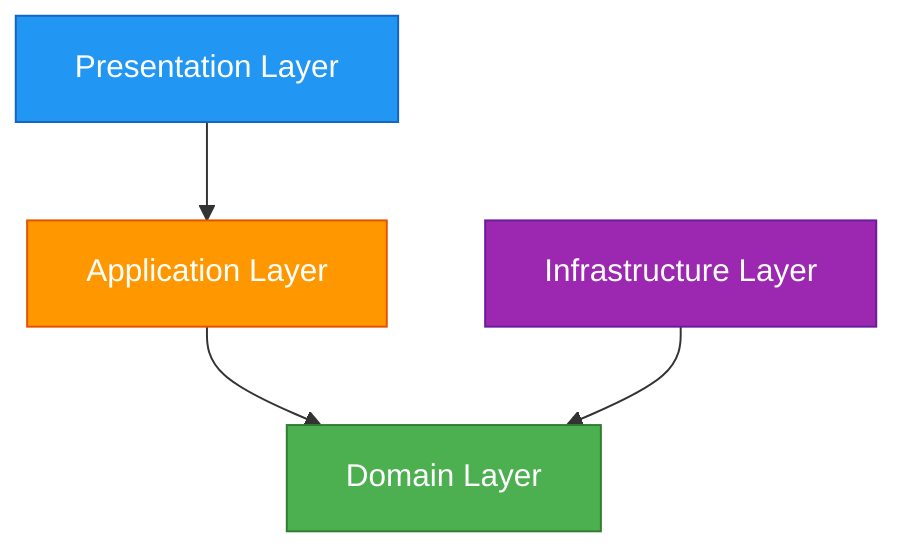

The Domain Layer represents the heart of Chapi's business logic, containing enterprise-wide business rules and entities. It follows Clean Architecture principles by being independent of external frameworks and infrastructure.

## Layer Overview

**Location**: `~/workspace/source/Chapi/Domain/`

**Responsibilities**:
- Define core business entities
- Establish repository interfaces (contracts)
- Define domain models and value objects
- Implement business rules and validation
- Remain framework-agnostic and testable

**Key Principle**: The Domain Layer has **zero dependencies** on other layers. All other layers depend on it.

## Core Components

### Entities

Entities represent core business objects with identity and lifecycle.

<Expandable title="Project Entity">
  The `Project` entity represents a .NET project managed by Chapi.

  ```csharp
  namespace Chapi.Domain.Entities;

  public class Project
  {
      public string FullPath { get; set; } = string.Empty;
      public string Name { get; set; } = string.Empty;
      public string CurrentBranch { get; set; } = string.Empty;
      public int AheadCount { get; set; }
      public int BehindCount { get; set; }

      public bool IsValid() => Directory.Exists(FullPath);
      public bool HasRemoteChanges() => AheadCount > 0 || BehindCount > 0;
  }
  ```

  **Business Rules**:
  - A project is only valid if its directory exists
  - Remote changes are tracked via ahead/behind counters

  **Source**: `Domain/Entities/Project.cs`
</Expandable>

<Expandable title="GitCommit Entity">
  Represents a Git commit with metadata and behavior.

  ```csharp
  namespace Chapi.Domain.Entities;

  public class GitCommit
  {
      public string Hash { get; set; } = string.Empty;
      public string Author { get; set; } = string.Empty;
      public string Message { get; set; } = string.Empty;
      public string Description { get; set; } = string.Empty;
      public DateTime Date { get; set; }
      public string RelativeDate { get; set; } = string.Empty;
      public bool IsUnpushed { get; set; }
      public List<string> Tags { get; set; } = new();

      public bool HasTags => Tags != null && Tags.Any();
      public string ShortHash => Hash.Length >= 7 ? Hash.Substring(0, 7) : Hash;
      public bool IsValid() => !string.IsNullOrWhiteSpace(Hash) && 
                               !string.IsNullOrWhiteSpace(Message);
  }
  ```

  **Domain Logic**:
  - Short hash generation for display
  - Tag association tracking
  - Validation rules for commit integrity

  **Source**: `Domain/Entities/GitCommit.cs`
</Expandable>

<Expandable title="ChatMessage Entity (Assistant)">
  Represents messages in the AI assistant conversation.

  ```csharp
  namespace Chapi.Domain.Entities.Assistant;

  public class ChatMessage
  {
      public string Text { get; set; } = string.Empty;
      public MessageAuthor Author { get; set; } = MessageAuthor.Assistant;
      public DateTime Timestamp { get; set; } = DateTime.Now;
      public string FormattedTime => Timestamp.ToString("HH:mm");
      public UserIntent? Action { get; set; }
  }

  public enum MessageAuthor
  {
      User,
      Assistant
  }
  ```

  **Source**: `Domain/Entities/Assistant/ChatMessage.cs`
</Expandable>

### Repository Interfaces

Repository interfaces define contracts for data access without implementation details.

<Expandable title="IGitRepository Interface">
  Comprehensive interface for all Git operations.

  ```csharp
  namespace Chapi.Domain.Interfaces;

  public interface IGitRepository
  {
      // Commits
      Task<Result<GitCommit>> CommitAsync(string projectPath, string message, 
                                          IEnumerable<string> files);
      Task<IEnumerable<GitCommit>> GetCommitsAsync(string projectPath, int limit);
      Task<HashSet<string>> GetUnpushedCommitsAsync(string projectPath, string branch);

      // Changes
      Task<IEnumerable<FileChange>> GetChangesAsync(string projectPath);
      Task<Result> StageFilesAsync(string projectPath, IEnumerable<string> files);
      Task<Result> UnstageFilesAsync(string projectPath, IEnumerable<string> files);
      Task<Result> DiscardChangesAsync(string projectPath, IEnumerable<string>? files = null);

      // Branches
      Task<IEnumerable<string>> GetBranchesAsync(string projectPath);
      Task<string> GetCurrentBranchAsync(string projectPath);
      Task<Result> SwitchBranchAsync(string projectPath, string branchName);
      Task<Result> CreateBranchAsync(string projectPath, string branchName, 
                                     string? fromCommitOrBranch = null);

      // Remote Operations
      Task<Result> PushAsync(string projectPath, string branch, bool force = false);
      Task<Result> PullAsync(string projectPath, string branch);
      Task<Result> FetchAsync(string projectPath);
      Task<(int Ahead, int Behind)> GetAheadBehindCountAsync(string projectPath);

      // Stash Operations
      Task<Result> StashChangesAsync(string projectPath, string message, 
                                     IEnumerable<string>? files = null);
      Task<IEnumerable<GitStash>> ListStashesAsync(string projectPath);
      Task<Result> StashPopAsync(string projectPath, int? index = null);

      // Tags
      Task<Result> CreateTagAsync(string projectPath, string tagName, 
                                  string message, string commitHash = null);
      Task<Result> DeleteTagLocalAsync(string projectPath, string tagName);

      // Configuration
      Task<string> GetConfigAsync(string projectPath, string key, bool isGlobal = false);
      Task<Result> SetConfigAsync(string projectPath, string key, string value, 
                                  bool isGlobal = false);
  }
  ```

  **Design Principles**:
  - Returns `Result<T>` for operations that can fail
  - Async by default for I/O operations
  - Groups related operations (Commits, Branches, Remote, etc.)
  - No infrastructure dependencies

  **Source**: `Domain/Interfaces/IGitRepository.cs:12`
</Expandable>

<Expandable title="IProjectRepository Interface">
  Simple CRUD interface for project management.

  ```csharp
  namespace Chapi.Domain.Interfaces;

  public interface IProjectRepository
  {
      Task<IEnumerable<Project>> GetAllProjectsAsync();
      Task<Project?> GetProjectAsync(string path);
      Task AddProjectAsync(string path);
      Task RemoveProjectAsync(string path);
  }
  ```

  **Source**: `Domain/Interfaces/IProjectRepository.cs`
</Expandable>

### Result Pattern

Chapi uses the Result pattern to handle success/failure without exceptions.

<Expandable title="Result Implementation">
  ```csharp
  namespace Chapi.Domain.Common;

  /// <summary>
  /// Represents the result of an operation that can fail.
  /// Use this pattern instead of exceptions for control flow.
  /// </summary>
  public class Result
  {
      public bool IsSuccess { get; protected set; }
      public string Error { get; protected set; } = string.Empty;

      public static Result Success() => new() { IsSuccess = true };
      public static Result Fail(string error) => new() { IsSuccess = false, Error = error };
  }

  /// <summary>
  /// Result with return data.
  /// </summary>
  public class Result<T> : Result
  {
      public T? Data { get; set; }

      public static Result<T> Success(T data) => new() { IsSuccess = true, Data = data };
      public new static Result<T> Fail(string error) => 
          new() { IsSuccess = false, Error = error };
  }
  ```

  **Benefits**:
  - Type-safe error handling
  - Explicit success/failure states
  - Avoids exception overhead
  - Forces error handling at call site

  **Usage Example**:
  ```csharp
  var result = await _gitRepo.CommitAsync(path, message, files);
  if (result.IsSuccess)
  {
      var commit = result.Data;
      // Handle success
  }
  else
  {
      // Handle failure: result.Error
  }
  ```

  **Source**: `Domain/Common/Result.cs`
</Expandable>

### Domain Models

Models represent data structures without identity or behavior.

<Expandable title="Key Domain Models">
  ```csharp
  // Git Repository Metadata
  public class GitRepositoryMetadata
  {
      public string UserName { get; set; }
      public string UserEmail { get; set; }
      public string RemoteUrl { get; set; }
      public string CurrentBranch { get; set; }
      public int Ahead { get; set; }
      public int Behind { get; set; }
      public bool IsDetached { get; set; }
  }

  // Remote Repository Information
  public class RemoteRepository
  {
      public string Name { get; set; }
      public string Description { get; set; }
      public string Url { get; set; }
      public bool IsPrivate { get; set; }
  }

  // Assistant Capability
  public class AssistantCapability
  {
      public string Id { get; set; }
      public string Description { get; set; }
      public Func<string, Task<Result>> Handler { get; set; }
  }
  ```

  **Source**: `Domain/Models/`
</Expandable>

### Enumerations

Domain-level enums define valid states and options.

```csharp
// Git Provider Types
public enum GitProvider
{
    Unknown,
    GitHub,
    GitLab
}

// Git Reset Modes
public enum ResetMode
{
    Soft,
    Mixed,
    Hard
}

// Task Priority Levels
public enum TaskPriority
{
    Low,
    Medium,
    High,
    Critical
}
```

**Source**: `Domain/Enums/`

## Domain Services

Domain services encapsulate business logic that doesn't naturally fit in entities.

<Expandable title="AvatarCacheService">
  Singleton service for caching user avatars.

  ```csharp
  namespace Chapi.Domain.Services;

  public class AvatarCacheService
  {
      private static readonly Lazy<AvatarCacheService> _instance = 
          new Lazy<AvatarCacheService>(() => new AvatarCacheService());

      public static AvatarCacheService Instance => _instance.Value;

      public event EventHandler<AvatarUpdatedEventArgs>? AvatarUpdated;

      public string GetGitHubAvatarUrl(string username)
      {
          return $"https://github.com/{username}.png";
      }

      public async Task<string> GetGitLabAvatarUrlAsync(string username)
      {
          // Fetch and cache GitLab avatar
      }
  }
  ```

  **Source**: `Domain/Services/AvatarCacheService.cs`
</Expandable>

## Dependency Flow



**Key Points**:
- Domain Layer is at the center
- No dependencies on external layers
- All layers depend on Domain contracts
- Infrastructure implements Domain interfaces

## Design Patterns

<CardGroup cols={2}>
  <Card title="Repository Pattern" icon="database">
    Abstracts data access through interfaces like `IGitRepository`
  </Card>
  <Card title="Result Pattern" icon="check-circle">
    Type-safe error handling without exceptions
  </Card>
  <Card title="Value Objects" icon="cube">
    Immutable models like `GitCommit` with validation
  </Card>
  <Card title="Domain Services" icon="gears">
    Business logic services like `AvatarCacheService`
  </Card>
</CardGroup>

## Testing Strategy

The Domain Layer is highly testable due to its isolation:

```csharp
[Test]
public void Project_IsValid_ReturnsFalse_WhenDirectoryDoesNotExist()
{
    var project = new Project { FullPath = "/nonexistent/path" };
    Assert.IsFalse(project.IsValid());
}

[Test]
public void GitCommit_ShortHash_ReturnsFirst7Characters()
{
    var commit = new GitCommit { Hash = "abc123def456" };
    Assert.AreEqual("abc123d", commit.ShortHash);
}
```

## Best Practices

<AccordionGroup>
  <Accordion title="Keep Domain Pure">
    - No references to UI frameworks (WPF, etc.)
    - No references to infrastructure libraries (Entity Framework, etc.)
    - Only .NET standard types and domain logic
  </Accordion>

  <Accordion title="Use Interfaces for External Dependencies">
    Define `IGitRepository`, `IProjectRepository` instead of concrete implementations
  </Accordion>

  <Accordion title="Validate Business Rules in Entities">
    ```csharp
    public bool IsValid() => Directory.Exists(FullPath);
    ```
  </Accordion>

  <Accordion title="Prefer Result over Exceptions">
    Return `Result<T>` for operations that can fail gracefully
  </Accordion>
</AccordionGroup>

## Related Documentation

<CardGroup cols={3}>
  <Card title="Application Layer" href="/architecture/application-layer" icon="layer-group">
    Use cases and application services
  </Card>
  <Card title="Infrastructure Layer" href="/architecture/infrastructure-layer" icon="server">
    Implementation of domain interfaces
  </Card>
  <Card title="Clean Architecture" href="/architecture/overview" icon="sitemap">
    Overall architecture principles
  </Card>
</CardGroup>