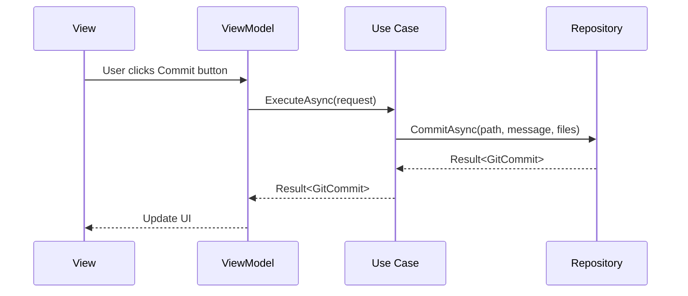

## Layer Overview

Chapi Assistant is organized into four distinct layers, each with specific responsibilities and dependencies:

```
Presentation Layer    ← User Interface
       ↓
Application Layer     ← Business Logic
       ↓
Domain Layer         ← Core Entities
       ↑
Infrastructure Layer  ← External Services
```

## Domain Layer

### Location

`Chapi/Domain/`

### Purpose

The Domain layer is the **heart of the application**. It contains the core business entities, rules, and abstractions that define what the application does, independent of how it does it.

### Structure

```
Domain/
├── Entities/              # Business objects
│   ├── Assistant/        # AI assistant entities
│   │   ├── ChatMessage.cs
│   │   ├── ConversationContext.cs
│   │   └── UserIntent.cs
│   ├── Workspace/        # Workspace entities
│   │   ├── WorkspaceData.cs
│   │   └── WorkspaceTask.cs
│   ├── GitCommit.cs      # Git domain entities
│   ├── FileChange.cs
│   ├── GitStash.cs
│   └── Project.cs
│
├── Interfaces/           # Abstractions
│   ├── IGitRepository.cs
│   ├── IProjectRepository.cs
│   ├── INotificationService.cs
│   ├── ICredentialStorageService.cs
│   └── IAssistantCapabilityRegistry.cs
│
├── Enums/               # Domain enumerations
│   ├── GitProvider.cs
│   ├── ResetMode.cs
│   └── TaskPriority.cs
│
├── Models/              # Domain models
│   └── Assistant/
│
└── Common/              # Shared domain logic
    └── Result.cs        # Result pattern
```

### Key Components

#### Entities

Business objects that have identity and lifecycle:

```csharp
namespace Chapi.Domain.Entities;

/// <summary>
/// Represents a Git commit.
/// </summary>
public class GitCommit
{
    public string Hash { get; set; } = string.Empty;
    public string Author { get; set; } = string.Empty;
    public string Message { get; set; } = string.Empty;
    public DateTime Date { get; set; }
    public string RelativeDate { get; set; } = string.Empty;
    public bool IsUnpushed { get; set; }
    public List<string> Tags { get; set; } = new();
    
    public string ShortHash => Hash.Length >= 7 ? Hash.Substring(0, 7) : Hash;
    public bool IsValid() => !string.IsNullOrWhiteSpace(Hash) && !string.IsNullOrWhiteSpace(Message);
}
```

```csharp
/// <summary>
/// Represents a file change in Git.
/// </summary>
public class FileChange
{
    public string FilePath { get; set; } = string.Empty;
    public ChangeStatus Status { get; set; }
    public int Additions { get; set; }
    public int Deletions { get; set; }
    
    public string FileName => Path.GetFileName(FilePath);
    public bool IsValid() => !string.IsNullOrWhiteSpace(FilePath);
}

public enum ChangeStatus
{
    Modified,
    Added,
    Deleted,
    Renamed,
    Untracked,
    Conflict
}
```

#### Interfaces

Abstractions that define contracts for external services:

```csharp
namespace Chapi.Domain.Interfaces;

public interface IGitRepository
{
    // Commits
    Task<Result<GitCommit>> CommitAsync(string projectPath, string message, IEnumerable<string> files);
    Task<IEnumerable<GitCommit>> GetCommitsAsync(string projectPath, int limit);
    Task<HashSet<string>> GetUnpushedCommitsAsync(string projectPath, string branch);
    
    // Changes
    Task<IEnumerable<FileChange>> GetChangesAsync(string projectPath);
    Task<Result> StageFilesAsync(string projectPath, IEnumerable<string> files);
    Task<Result> DiscardChangesAsync(string projectPath, IEnumerable<string>? files = null);
    
    // Branches
    Task<IEnumerable<string>> GetBranchesAsync(string projectPath);
    Task<string> GetCurrentBranchAsync(string projectPath);
    Task<Result> SwitchBranchAsync(string projectPath, string branchName);
    
    // Remote
    Task<Result> PushAsync(string projectPath, string branch, bool force = false);
    Task<Result> PullAsync(string projectPath, string branch);
    Task<Result> FetchAsync(string projectPath);
}
```

#### Common Patterns

The Result pattern for error handling:

```csharp
namespace Chapi.Domain.Common;

/// <summary>
/// Represents the result of an operation that can fail.
/// Use this pattern instead of exceptions for control flow.
/// </summary>
public class Result
{
    public bool IsSuccess { get; protected set; }
    public string Error { get; protected set; } = string.Empty;
    
    public static Result Success() => new() { IsSuccess = true };
    public static Result Fail(string error) => new() { IsSuccess = false, Error = error };
}

public class Result<T> : Result
{
    public T? Data { get; set; }
    
    public static Result<T> Success(T data) => new() { IsSuccess = true, Data = data };
    public new static Result<T> Fail(string error) => new() { IsSuccess = false, Error = error };
}
```

### Design Rules

<Warning>
  **The Domain layer must have ZERO dependencies on other layers**
  
  - No references to WPF or UI frameworks
  - No references to external libraries (except .NET BCL)
  - No references to Infrastructure implementations
  - No references to Application or Presentation layers
</Warning>

---

## Application Layer

### Location

`Chapi/Application/`

### Purpose

The Application layer contains **business logic and orchestration**. It defines Use Cases that coordinate between Domain entities and Infrastructure services.

### Structure

```
Application/
├── UseCases/
│   ├── Git/                    # Git operations
│   │   ├── CommitChangesUseCase.cs
│   │   ├── CreateBranchUseCase.cs
│   │   ├── PushChangesUseCase.cs
│   │   ├── PullChangesUseCase.cs
│   │   ├── FetchChangesUseCase.cs
│   │   ├── LoadChangesUseCase.cs
│   │   └── GetBranchesUseCase.cs
│   │
│   ├── CodeGeneration/         # Code generation
│   │   ├── GenerateModuleUseCase.cs
│   │   ├── AddApiControllerUseCase.cs
│   │   ├── AddApiEndpointUseCase.cs
│   │   └── AddDependencyInjectionUseCase.cs
│   │
│   ├── AI/                     # AI operations
│   │   ├── GenerateCommitMessageUseCase.cs
│   │   ├── GenerateSqlQueryUseCase.cs
│   │   └── SendChatMessageUseCase.cs
│   │
│   ├── Projects/               # Project management
│   │   ├── CreateProjectUseCase.cs
│   │   ├── LoadProjectUseCase.cs
│   │   └── CloneProjectUseCase.cs
│   │
│   └── Auth/                   # Authentication
│       └── LoginGitHubUseCase.cs
│
├── Services/                   # Application services
│   └── Assistant/
│       ├── ConversationManager.cs
│       ├── ProjectContextBuilder.cs
│       └── AssistantCapabilityRegistry.cs
│
└── Interfaces/                 # Application abstractions
    └── Workspace/
        └── IWorkspaceService.cs
```

### Use Case Pattern

Each Use Case represents a single business operation:

```csharp
namespace Chapi.Application.UseCases.Git;

public class CommitRequest
{
    public string ProjectPath { get; set; } = string.Empty;
    public string Message { get; set; } = string.Empty;
    public IEnumerable<string> Files { get; set; } = Enumerable.Empty<string>();
}

public class CommitChangesUseCase
{
    private readonly IGitRepository _gitRepo;
    private readonly INotificationService _notifications;
    
    public CommitChangesUseCase(
        IGitRepository gitRepo, 
        INotificationService notifications)
    {
        _gitRepo = gitRepo;
        _notifications = notifications;
    }
    
    public async Task<Result<GitCommit>> ExecuteAsync(CommitRequest request)
    {
        // 1. Validate
        var validation = Validate(request);
        if (!validation.IsSuccess)
        {
            _notifications.ShowWarning(validation.Error);
            return Result<GitCommit>.Fail(validation.Error);
        }
        
        // 2. Execute operation
        var result = await _gitRepo.CommitAsync(
            request.ProjectPath, 
            request.Message, 
            request.Files);
        
        // 3. Notify result
        if (result.IsSuccess)
            _notifications.ShowSuccess($"Commit: {request.Message}");
        else
            _notifications.ShowError($"Error: {result.Error}");
        
        return result;
    }
    
    private Result Validate(CommitRequest request)
    {
        if (string.IsNullOrWhiteSpace(request.ProjectPath))
            return Result.Fail("Invalid project path");
        if (string.IsNullOrWhiteSpace(request.Message))
            return Result.Fail("Commit message required");
        if (!request.Files.Any())
            return Result.Fail("No files selected");
        return Result.Success();
    }
}
```

### Benefits of Use Cases

- **Single Responsibility**: One Use Case = One business operation
- **Testable**: Easy to unit test with mocks
- **Reusable**: Can be called from multiple ViewModels
- **Clear Intent**: Names describe what the operation does
- **Independent**: Not coupled to UI or infrastructure details

---

## Infrastructure Layer

### Location

`Chapi/Infrastructure/`

### Purpose

The Infrastructure layer contains **implementations of Domain interfaces** using external libraries and services.

### Structure

```
Infrastructure/
├── Git/                        # Git implementations
│   ├── LibGit2SharpRepository.cs      # Main Git repository
│   ├── LibGit2SharpRepository.Merge.cs # Merge operations
│   ├── GitRepositoryDispatcher.cs     # Command dispatcher
│   ├── GitChangeWatcher.cs            # File watcher
│   ├── GitChangesCache.cs             # Change caching
│   └── WslCommandExecutor.cs          # WSL support
│
├── AI/                         # AI client implementations
│   ├── GeminiChatClient.cs
│   ├── OpenAiChatClient.cs
│   ├── ClaudeChatClient.cs
│   └── GetPrompt.cs
│
├── Persistence/                # Data persistence
│   ├── Settings/
│   └── Rollbacks/
│
├── Services/                   # Infrastructure services
│   └── Auth/
│
├── Roslyn/                     # Code analysis
│
├── Configuration/              # Configuration
│   └── GitAuthConfig.cs
│
└── Common/                     # Utilities
    ├── FileHelper.cs
    ├── TimeHelper.cs
    └── RenameDirectoryAndFiles.cs
```

### Git Repository Implementation

```csharp
namespace Chapi.Infrastructure.Git;

public partial class LibGit2SharpRepository : IGitRepository
{
    private readonly IGitAuthProviderFactory _authFactory;
    private readonly ICredentialStorageService _credentialStorage;
    
    public LibGit2SharpRepository(
        IGitAuthProviderFactory authFactory,
        ICredentialStorageService credentialStorage)
    {
    _authFactory = authFactory;
        _credentialStorage = credentialStorage;
    }
    
    public async Task<Result<GitCommit>> CommitAsync(
        string projectPath, 
        string message, 
        IEnumerable<string> files)
    {
        return await Task.Run(() =>
        {
            try
            {
                using var repo = new Repository(projectPath);
                
                // Stage files
                Commands.Stage(repo, files);
                
                // Create signature
                var signature = repo.Config.BuildSignature(DateTimeOffset.Now);
                if (signature == null)
                    return Result<GitCommit>.Fail("Git user not configured");
                
                // Commit
                var commit = repo.Commit(message, signature, signature);
                
                return Result<GitCommit>.Success(new GitCommit
                {
                    Hash = commit.Sha,
                    Message = commit.MessageShort,
                    Author = commit.Author.Name,
                    Date = commit.Author.When.DateTime
                });
            }
            catch (Exception ex)
            {
                return Result<GitCommit>.Fail($"Commit error: {ex.Message}");
            }
        });
    }
}
```

### Technology Choices

- **LibGit2Sharp**: Native Git operations without requiring git.exe
- **HTTP Clients**: For AI API calls (Gemini, OpenAI, Claude)
- **Windows Credential Manager**: Secure credential storage
- **Roslyn**: C# code analysis and generation

---

## Presentation Layer

### Location

`Chapi/Presentation/`

### Purpose

The Presentation layer handles **user interface concerns** using the MVVM pattern.

### Structure

```
Presentation/
├── ViewModels/                 # MVVM ViewModels
│   ├── AssistantViewModel.cs
│   ├── ChangeItemViewModel.cs
│   └── Dialogs/
│
├── Views/                      # XAML Views
│   ├── Agent/
│   ├── Settings/
│   ├── Tabs/
│   └── Dialogs/
│
├── Converters/                 # Value Converters
│   ├── BooleanToIconConverter.cs
│   ├── GitProviderAvatarConverter.cs
│   └── ZeroCountToVisibilityConverter.cs
│
└── Assets/                     # UI Resources
    └── Resources/
```

### ViewModel Example

```csharp
namespace Chapi.Presentation.ViewModels;

public class ChangesViewModel : ViewModelBase
{
    private readonly CommitChangesUseCase _commitUseCase;
    private readonly LoadChangesUseCase _loadChangesUseCase;
    private readonly IDialogService _dialogService;
    
    private string _commitMessage;
    private ObservableCollection<FileChangeViewModel> _changes;
    
    public ChangesViewModel(
        CommitChangesUseCase commitUseCase,
        LoadChangesUseCase loadChangesUseCase,
        IDialogService dialogService)
    {
        _commitUseCase = commitUseCase;
        _loadChangesUseCase = loadChangesUseCase;
        _dialogService = dialogService;
        
        Changes = new ObservableCollection<FileChangeViewModel>();
        CommitCommand = new RelayCommand(CommitAsync, CanCommit);
        RefreshCommand = new RelayCommand(LoadChangesAsync);
    }
    
    public string CommitMessage
    {
        get => _commitMessage;
        set
        {
            _commitMessage = value;
            OnPropertyChanged();
            CommitCommand.RaiseCanExecuteChanged();
        }
    }
    
    public ObservableCollection<FileChangeViewModel> Changes { get; }
    public ICommand CommitCommand { get; }
    public ICommand RefreshCommand { get; }
    
    private bool CanCommit() => 
        !string.IsNullOrWhiteSpace(CommitMessage) && 
        Changes.Any(c => c.IsSelected);
    
    private async Task CommitAsync()
    {
        var request = new CommitRequest(
            ProjectPath: CurrentProjectPath,
            Message: CommitMessage,
            Files: Changes.Where(c => c.IsSelected).Select(c => c.FilePath)
        );
        
        var result = await _commitUseCase.ExecuteAsync(request);
        
        if (result.IsSuccess)
        {
            CommitMessage = string.Empty;
            await LoadChangesAsync();
        }
    }
}
```

### MainWindow Simplification

Before refactoring: **3,637 lines**

After refactoring: **~200 lines**

```csharp
namespace Chapi.Presentation.Views;

public partial class MainWindow : Window
{
    public MainWindow(MainViewModel viewModel)
    {
        InitializeComponent();
        DataContext = viewModel;
    }
    
    // Only window-specific event handlers remain
    // All business logic moved to ViewModels and Use Cases
}
```

---

## Layer Communication

### Correct Flow



### Dependency Injection

All layers are wired together in `App.xaml.cs`:

```csharp
private void ConfigureServices(IServiceCollection services)
{
    // Infrastructure - Implements Domain interfaces
    services.AddScoped<IGitRepository, LibGit2SharpRepository>();
    services.AddSingleton<INotificationService, NotificationService>();
    services.AddSingleton<ICredentialStorageService, CredentialStorageService>();
    
    // Application - Use Cases
    services.AddTransient<CommitChangesUseCase>();
    services.AddTransient<LoadChangesUseCase>();
    services.AddTransient<CreateBranchUseCase>();
    
    // Presentation - ViewModels
    services.AddTransient<ChangesViewModel>();
    services.AddTransient<MainViewModel>();
    
    // Presentation - Views
    services.AddTransient<MainWindow>();
}
```

## Summary

| Layer | Responsibility | Dependencies | Examples |
|-------|---------------|--------------|----------|
| **Domain** | Core business entities and rules | None | `GitCommit`, `IGitRepository` |
| **Application** | Business logic orchestration | Domain | `CommitChangesUseCase` |
| **Infrastructure** | External service implementations | Domain | `LibGit2SharpRepository` |
| **Presentation** | UI and user interaction | Application, Domain | `ChangesViewModel` |

<Tip>
  Each layer has a clear responsibility and dependencies flow inward toward the Domain. This creates a maintainable, testable, and scalable architecture.
</Tip>
