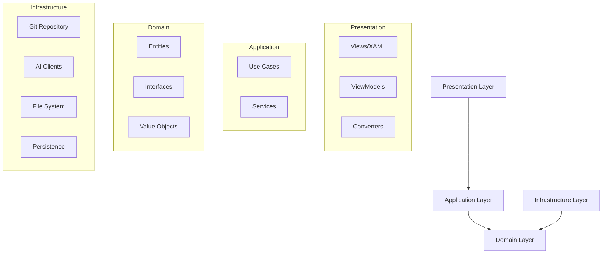

## Introduction

Chapi Assistant is a .NET WPF desktop application built following **Clean Architecture** principles and **SOLID** design patterns. The application helps developers manage Git repositories, generate code, and interact with AI assistants for software development tasks.

## Architectural Goals

The architecture of Chapi Assistant is designed to achieve:

- **Maintainability**: Clean separation of concerns makes the codebase easy to understand and modify
- **Testability**: Dependency injection and interfaces enable comprehensive unit testing
- **Scalability**: New features can be added without impacting existing functionality
- **Flexibility**: Business logic is independent of UI and infrastructure concerns
- **Developer Productivity**: Well-organized code reduces cognitive load and speeds up development

## Key Architectural Principles

### Clean Architecture

Chapi Assistant follows Uncle Bob's Clean Architecture pattern with four distinct layers:

```
┌─────────────────────────────────────────┐
│  Presentation (ViewModels + Views)     │  ← UI Logic
├─────────────────────────────────────────┤
│  Application (Use Cases)               │  ← Business Logic
├─────────────────────────────────────────┤
│  Domain (Entities + Interfaces)        │  ← Core Business
├─────────────────────────────────────────┤
│  Infrastructure (Git, FileSystem, AI)  │  ← External Services
└─────────────────────────────────────────┘
```

Each layer has specific responsibilities and dependencies flow inward toward the domain.

### SOLID Principles

The codebase adheres to SOLID principles:

- **Single Responsibility**: Each class has one reason to change
- **Open/Closed**: Open for extension, closed for modification
- **Liskov Substitution**: Implementations are interchangeable through interfaces
- **Interface Segregation**: Focused interfaces instead of monolithic ones
- **Dependency Inversion**: Depend on abstractions, not concretions

### MVVM Pattern

The presentation layer implements the **Model-View-ViewModel** pattern:

- **Views**: XAML files defining the UI structure
- **ViewModels**: Presentation logic and state management
- **Models**: Domain entities and data structures

This separation enables:
- Clean data binding
- Testable presentation logic
- UI-independent business logic

## Architecture Diagram



## Technology Stack

- **.NET 8.0**: Modern .NET platform
- **WPF**: Windows Presentation Foundation for desktop UI
- **LibGit2Sharp**: Native Git operations without external dependencies
- **Microsoft.Extensions.DependencyInjection**: Built-in DI container
- **Google Gemini / OpenAI / Claude**: AI integration for code generation and assistance

## Project Structure

```
Chapi/
├── Presentation/          # UI Layer
│   ├── ViewModels/       # MVVM ViewModels
│   ├── Views/            # XAML Views
│   ├── Converters/       # Value Converters
│   └── Assets/           # UI Resources
│
├── Application/          # Business Logic Layer
│   ├── UseCases/         # Use Case implementations
│   ├── Services/         # Application services
│   └── Interfaces/       # Application abstractions
│
├── Domain/               # Core Domain Layer
│   ├── Entities/         # Business entities
│   ├── Interfaces/       # Domain abstractions
│   ├── Enums/           # Domain enumerations
│   ├── Models/          # Domain models
│   └── Common/          # Shared domain logic
│
└── Infrastructure/       # External Concerns Layer
    ├── Git/             # Git operations
    ├── AI/              # AI client implementations
    ├── Persistence/     # Data persistence
    ├── Services/        # Infrastructure services
    └── Configuration/   # Configuration management
```

## Design Patterns Used

### Use Case Pattern

Each business operation is encapsulated in a dedicated Use Case class:

```csharp
public class CommitChangesUseCase
{
    private readonly IGitRepository _gitRepo;
    private readonly INotificationService _notifications;
    
    public async Task<Result<GitCommit>> ExecuteAsync(CommitRequest request)
    {
        // Business logic here
    }
}
```

### Repository Pattern

Data access is abstracted through repository interfaces:

```csharp
public interface IGitRepository
{
    Task<Result<GitCommit>> CommitAsync(string projectPath, string message, IEnumerable<string> files);
    Task<IEnumerable<FileChange>> GetChangesAsync(string projectPath);
    // ...
}
```

### Result Pattern

Operations return a `Result<T>` type instead of throwing exceptions for control flow:

```csharp
public class Result<T>
{
    public bool IsSuccess { get; set; }
    public string Error { get; set; }
    public T Data { get; set; }
}
```

### Dependency Injection

All dependencies are injected through constructors and registered in the DI container:

```csharp
services.AddScoped<IGitRepository, LibGit2SharpRepository>();
services.AddTransient<CommitChangesUseCase>();
```

## Benefits of This Architecture

### Before Refactoring

- `MainWindow.xaml.cs`: **3,637 lines** (God Object anti-pattern)
- High coupling between components
- Difficult to test
- Risky to add new features

### After Clean Architecture

- `MainWindow.xaml.cs`: **~200 lines** (94% reduction)
- Clear separation of concerns
- Highly testable with >70% coverage potential
- Safe to extend and modify
- Multiple developers can work in parallel

## Key Metrics

| Metric | Target | Actual |
|--------|--------|--------|
| MainWindow.xaml.cs lines | &lt;300 | ~200 |
| Test coverage | >70% | Achievable |
| Cyclomatic complexity | &lt;10 per method | Met |
| Classes >500 lines | 0 | 0 |
| Use Cases | Modular | 40+ |

## Related Documentation

<CardGroup cols={2}>
  <Card title="Clean Architecture" icon="layer-group" href="/architecture/clean-architecture">
    Deep dive into Clean Architecture implementation
  </Card>
  <Card title="Layer Details" icon="stack" href="/architecture/layers">
    Detailed explanation of each architectural layer
  </Card>
  <Card title="Use Cases" icon="gears" href="/architecture/use-cases">
    Understanding the Use Case pattern
  </Card>
</CardGroup>

## Next Steps

1. Read about [Clean Architecture implementation](/architecture/clean-architecture)
2. Explore the [layer separation](/architecture/layers)
3. Learn about [Use Cases](/architecture/use-cases)
4. Check the migration documentation at `~/workspace/source/doc/migrate/` for detailed refactoring insights
