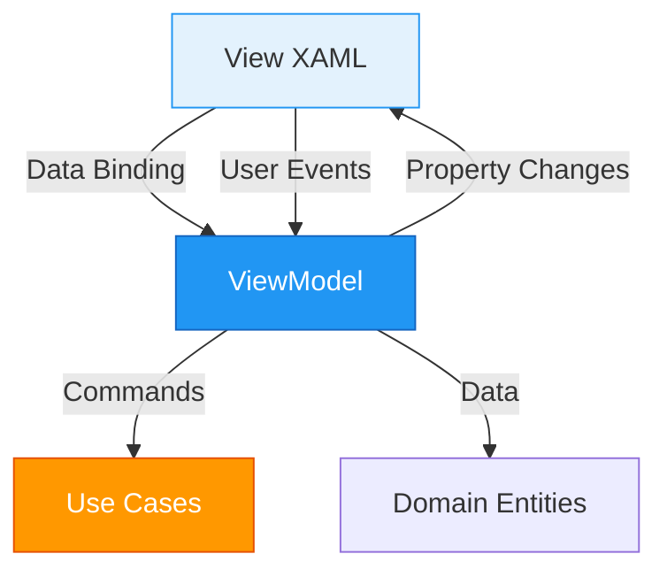

The Presentation Layer contains the WPF user interface, ViewModels, and View-related logic. It follows the MVVM (Model-View-ViewModel) pattern to separate UI from business logic.

## Layer Overview

**Location**: `~/workspace/source/Chapi/Presentation/`

**Responsibilities**:
- Display user interface (XAML Views)
- Handle user input and interactions
- Implement ViewModels for data binding
- Manage navigation and dialogs
- Convert data for display (Value Converters)

**Dependencies**: 
- ✅ Depends on Application Layer (use cases)
- ✅ Depends on Domain Layer (entities for display)
- ✅ WPF framework dependencies
- ❌ No dependencies on Infrastructure

## MVVM Architecture



## ViewModels

ViewModels expose data and commands for Views to bind to.

### Base ViewModel

<Expandable title="ViewModelBase">
  Base class providing `INotifyPropertyChanged` implementation.

  ```csharp
  namespace Chapi.Presentation.ViewModels;

  /// <summary>
  /// Base class for all ViewModels.
  /// Implements INotifyPropertyChanged for data binding.
  /// </summary>
  public abstract class ViewModelBase : INotifyPropertyChanged
  {
      public event PropertyChangedEventHandler? PropertyChanged;

      /// <summary>
      /// Notifies that a property has changed.
      /// </summary>
      protected virtual void OnPropertyChanged(
          [CallerMemberName] string? propertyName = null)
      {
          PropertyChanged?.Invoke(this, new PropertyChangedEventArgs(propertyName));
      }

      /// <summary>
      /// Sets property value and notifies if changed.
      /// </summary>
      protected bool SetProperty<T>(
          ref T field, 
          T value, 
          [CallerMemberName] string? propertyName = null)
      {
          if (EqualityComparer<T>.Default.Equals(field, value))
              return false;

          field = value;
          OnPropertyChanged(propertyName);
          return true;
      }
  }
  ```

  **Features**:
  - Automatic property name resolution via `[CallerMemberName]`
  - Equality check to prevent unnecessary notifications
  - Returns `bool` to indicate if value changed

  **Source**: `Presentation/ViewModels/ViewModelBase.cs`
</Expandable>

### Command Implementation

<Expandable title="RelayCommand & AsyncRelayCommand">
  Command implementations for binding UI actions to ViewModel methods.

  ```csharp
  namespace Chapi.Presentation.ViewModels;

  /// <summary>
  /// Synchronous command implementation.
  /// </summary>
  public class RelayCommand : ICommand
  {
      private readonly Action<object?> _execute;
      private readonly Func<object?, bool>? _canExecute;

      public event EventHandler? CanExecuteChanged
      {
          add => CommandManager.RequerySuggested += value;
          remove => CommandManager.RequerySuggested -= value;
      }

      public RelayCommand(
          Action<object?> execute, 
          Func<object?, bool>? canExecute = null)
      {
          _execute = execute ?? throw new ArgumentNullException(nameof(execute));
          _canExecute = canExecute;
      }

      public bool CanExecute(object? parameter) => 
          _canExecute?.Invoke(parameter) ?? true;

      public void Execute(object? parameter) => _execute(parameter);

      public void RaiseCanExecuteChanged() => 
          CommandManager.InvalidateRequerySuggested();
  }

  /// <summary>
  /// Asynchronous command implementation.
  /// </summary>
  public class AsyncRelayCommand : ICommand
  {
      private readonly Func<object?, Task> _execute;
      private readonly Func<object?, bool>? _canExecute;
      private bool _isExecuting;

      public event EventHandler? CanExecuteChanged
      {
          add => CommandManager.RequerySuggested += value;
          remove => CommandManager.RequerySuggested -= value;
      }

      public bool CanExecute(object? parameter)
      {
          return !_isExecuting && (_canExecute?.Invoke(parameter) ?? true);
      }

      public async void Execute(object? parameter)
      {
          if (!CanExecute(parameter))
              return;

          _isExecuting = true;
          RaiseCanExecuteChanged();

          try
          {
              await _execute(parameter);
          }
          finally
          {
              _isExecuting = false;
              RaiseCanExecuteChanged();
          }
      }

      public void RaiseCanExecuteChanged() => 
          CommandManager.InvalidateRequerySuggested();
  }
  ```

  **Features**:
  - `RelayCommand`: For synchronous operations
  - `AsyncRelayCommand`: Prevents concurrent execution
  - Automatic disable during execution
  - Manual `CanExecute` refresh support

  **Source**: `Presentation/ViewModels/RelayCommand.cs`
</Expandable>

### Main ViewModels

<Expandable title="ChangesViewModel">
  Manages Git changes view with file selection, commit, and stash operations.

  ```csharp
  namespace Chapi.Presentation.ViewModels;

  public class ChangesViewModel : ViewModelBase
  {
      private readonly LoadChangesUseCase _loadChangesUseCase;
      private readonly CommitChangesUseCase _commitChangesUseCase;
      private readonly IGitRepository _gitRepository;
      private readonly GitChangeWatcher _changeWatcher;
      private readonly GitChangesCache _changesCache;

      private string _projectPath = string.Empty;
      private string _commitSummary = string.Empty;
      private string _commitDescription = string.Empty;
      private bool _isGenerating;

      public event EventHandler? CommitCompleted;

      public ChangesViewModel(
          LoadChangesUseCase loadChangesUseCase,
          CommitChangesUseCase commitChangesUseCase,
          IGitRepository gitRepository,
          /* ... other dependencies ... */)
      {
          _loadChangesUseCase = loadChangesUseCase;
          _commitChangesUseCase = commitChangesUseCase;
          _gitRepository = gitRepository;

          // Initialize collections
          Changes = new ObservableCollection<ChangeItemViewModel>();
          Stashes = new ObservableCollection<GitStash>();
          DiffLines = new ObservableCollection<DiffPiece>();

          // Initialize change watcher
          _changeWatcher = new GitChangeWatcher();
          _changesCache = new GitChangesCache();
          _changeWatcher.RepositoryChanged += OnRepositoryChanged;

          // Initialize commands
          LoadChangesCommand = new AsyncRelayCommand(
              async _ => await LoadChangesAsync());
          CommitCommand = new AsyncRelayCommand(
              async _ => await CommitAsync(), 
              _ => CanCommit());
          SelectAllCommand = new RelayCommand(_ => SelectAll());
          GenerateCommitMessageCommand = new AsyncRelayCommand(
              async _ => await GenerateCommitMessageAsync());
      }

      // Properties
      public ObservableCollection<ChangeItemViewModel> Changes { get; }
      
      public string ProjectPath
      {
          get => _projectPath;
          set
          {
              if (SetProperty(ref _projectPath, value))
              {
                  if (!string.IsNullOrWhiteSpace(value))
                      _changeWatcher.WatchRepository(value);
                  
                  _ = LoadChangesAsync();
              }
          }
      }

      public string CommitSummary
      {
          get => _commitSummary;
          set
          {
              if (SetProperty(ref _commitSummary, value))
                  (CommitCommand as AsyncRelayCommand)?.RaiseCanExecuteChanged();
          }
      }

      public bool IsGenerating
      {
          get => _isGenerating;
          set => SetProperty(ref _isGenerating, value);
      }

      public int SelectedCount => Changes.Count(c => c.IsSelected);

      // Commands
      public AsyncRelayCommand LoadChangesCommand { get; }
      public AsyncRelayCommand CommitCommand { get; }
      public RelayCommand SelectAllCommand { get; }
      public AsyncRelayCommand GenerateCommitMessageCommand { get; }

      // Methods
      public async Task LoadChangesAsync()
      {
          if (string.IsNullOrWhiteSpace(ProjectPath))
              return;

          IsSyncing = true;

          try
          {
              // Try cache first
              if (_changesCache.TryGetChanges(
                  ProjectPath, 
                  out var cachedChanges, 
                  out var cachedAdditions, 
                  out var cachedDeletions))
              {
                  await Application.Current.Dispatcher.InvokeAsync(() =>
                  {
                      Changes.Clear();
                      foreach (var fileChange in cachedChanges)
                      {
                          var viewModel = MapToViewModel(fileChange);
                          Changes.Add(viewModel);
                      }
                  });

                  TotalAdditions = cachedAdditions;
                  TotalDeletions = cachedDeletions;
                  return;
              }

              // Load from repository
              var fileChanges = await _loadChangesUseCase.ExecuteAsync(ProjectPath);

              var viewModels = fileChanges.Select(MapToViewModel).ToList();

              await Application.Current.Dispatcher.InvokeAsync(() =>
              {
                  Changes.Clear();
                  foreach (var vm in viewModels)
                      Changes.Add(vm);
              });

              // Load stats in background
              _ = LoadFileStatsInBackgroundAsync(cancellationToken);
          }
          finally
          {
              IsSyncing = false;
          }
      }

      private async Task CommitAsync()
      {
          var selectedFiles = Changes.Where(c => c.IsSelected).Select(c => c.FilePath);

          if (!selectedFiles.Any())
              return;

          string message = CommitSummary;
          if (!string.IsNullOrWhiteSpace(CommitDescription))
              message += $"\n\n{CommitDescription}";

          var request = new CommitRequest
          {
              ProjectPath = ProjectPath,
              Message = message,
              Files = selectedFiles
          };

          var result = await _commitChangesUseCase.ExecuteAsync(request);

          if (result.IsSuccess)
          {
              CommitSummary = string.Empty;
              CommitDescription = string.Empty;

              _changesCache.Invalidate(ProjectPath);
              await LoadChangesAsync();

              CommitCompleted?.Invoke(this, EventArgs.Empty);
          }
      }

      private bool CanCommit()
      {
          return !string.IsNullOrWhiteSpace(CommitSummary) &&
                 Changes.Any(c => c.IsSelected);
      }

      private async Task GenerateCommitMessageAsync()
      {
          if (string.IsNullOrEmpty(ProjectPath)) return;

          var selectedFiles = Changes.Where(c => c.IsSelected)
              .Select(c => c.FilePath).ToList();
          if (!selectedFiles.Any()) return;

          IsGenerating = true;
          try
          {
              // Get consolidated diff
              var diffBuilder = new StringBuilder();
              foreach (var file in selectedFiles)
              {
                  var diff = await _gitRepository.GetDiffAsync(ProjectPath, file);
                  diffBuilder.AppendLine(diff);
              }

              var fullDiff = diffBuilder.ToString();
              var result = await _generateCommitMessageUseCase.ExecuteAsync(fullDiff);

              if (result.IsSuccess)
              {
                  var commitMsg = JsonSerializer.Deserialize<CommitMessageResponse>(
                      result.Data);
                  if (commitMsg != null)
                  {
                      CommitSummary = commitMsg.Summary;
                      CommitDescription = commitMsg.Description;
                  }
              }
          }
          finally
          {
              IsGenerating = false;
          }
      }

      private void OnRepositoryChanged(object? sender, string projectPath)
      {
          if (projectPath == ProjectPath)
          {
              _changesCache.Invalidate(projectPath);
              Application.Current?.Dispatcher.InvokeAsync(async () =>
              {
                  await LoadChangesAsync();
              });
          }
      }
  }
  ```

  **Key Features**:
  - File watcher integration for auto-refresh
  - Cache support for performance
  - AI-powered commit message generation
  - Stash management
  - Progress reporting

  **Source**: `Presentation/ViewModels/ChangesViewModel.cs`
</Expandable>

## Value Converters

Converters transform data between ViewModel and View.

<Expandable title="Common Converters">
  ```csharp
  // Boolean to Visibility
  public class BooleanToVisibilityConverter : IValueConverter
  {
      public object Convert(object value, Type targetType, object parameter, CultureInfo culture)
      {
          return (bool)value ? Visibility.Visible : Visibility.Collapsed;
      }
  }

  // Inverse Boolean to Visibility
  public class InverseBooleanToVisibilityConverter : IValueConverter
  {
      public object Convert(object value, Type targetType, object parameter, CultureInfo culture)
      {
          return (bool)value ? Visibility.Collapsed : Visibility.Visible;
      }
  }

  // Git Provider to Avatar URL
  public class GitHubAvatarConverter : IValueConverter
  {
      public object Convert(object value, Type targetType, object parameter, CultureInfo culture)
      {
          if (value is string username && !string.IsNullOrWhiteSpace(username))
          {
              return new BitmapImage(new Uri($"https://github.com/{username}.png"));
          }
          return null;
      }
  }

  // Email to Gravatar
  public class EmailToGravatarConverter : IValueConverter
  {
      public object Convert(object value, Type targetType, object parameter, CultureInfo culture)
      {
          if (value is string email && !string.IsNullOrWhiteSpace(email))
          {
              var hash = MD5.Create().ComputeHash(Encoding.UTF8.GetBytes(email.ToLower()));
              var hashString = BitConverter.ToString(hash).Replace("-", "").ToLower();
              return new BitmapImage(new Uri($"https://www.gravatar.com/avatar/{hashString}?s=200"));
          }
          return null;
      }
  }
  ```

  **Source**: `Presentation/Converters/`
</Expandable>

## View Structure

Views are organized by functionality:

```
Presentation/Views/
├── Tabs/
│   ├── ChangesView.xaml       # Git changes and commits
│   ├── HistoryView.xaml       # Commit history
│   ├── ReleasesView.xaml      # GitHub releases
│   ├── WorkspaceView.xaml     # Tasks and notes
│   └── AssistantView.xaml     # AI chat assistant
├── Dialogs/
│   ├── CloneRepositoryDialog.xaml
│   ├── SwitchBranchDialog.xaml
│   ├── CreateReleaseDialog.xaml
│   └── GitConfigDialog.xaml
└── Agent/
    ├── SqlGeneratorView.xaml
    ├── AddMethodView.xaml
    └── RollbackSelectorView.xaml
```

## Data Binding Examples

<Expandable title="XAML Binding Patterns">
  ```xml
  <!-- Simple Property Binding -->
  <TextBox Text="{Binding CommitSummary, UpdateSourceTrigger=PropertyChanged}" />

  <!-- Command Binding -->
  <Button Command="{Binding CommitCommand}"
          Content="Commit" />

  <!-- Command with Parameter -->
  <Button Command="{Binding DiscardCommand}"
          CommandParameter="{Binding SelectedChange}" />

  <!-- Visibility with Converter -->
  <ProgressBar Visibility="{Binding IsLoading, 
                            Converter={StaticResource BoolToVisibility}}" />

  <!-- Collection Binding -->
  <ListBox ItemsSource="{Binding Changes}"
           SelectedItem="{Binding SelectedChange}">
      <ListBox.ItemTemplate>
          <DataTemplate>
              <StackPanel>
                  <TextBlock Text="{Binding FileName}" />
                  <TextBlock Text="{Binding Status}" />
              </StackPanel>
          </DataTemplate>
      </ListBox.ItemTemplate>
  </ListBox>

  <!-- Multi-Binding Example -->
  <TextBlock>
      <TextBlock.Text>
          <MultiBinding StringFormat="{}{0} files (+{1} -{2})">
              <Binding Path="TotalChangesCount" />
              <Binding Path="TotalAdditions" />
              <Binding Path="TotalDeletions" />
          </MultiBinding>
      </TextBlock.Text>
  </TextBlock>

  <!-- Event to Command -->
  <ListBox>
      <i:Interaction.Triggers>
          <i:EventTrigger EventName="SelectionChanged">
              <i:InvokeCommandAction Command="{Binding SelectionChangedCommand}" />
          </i:EventTrigger>
      </i:Interaction.Triggers>
  </ListBox>
  ```
</Expandable>

## Dialog Pattern

Chapi uses MaterialDesignThemes for dialogs:

```csharp
// Show dialog
var dialog = new CloneRepositoryDialog
{
    DataContext = new CloneRepositoryViewModel()
};

var result = await DialogHost.Show(dialog, "RootDialog");

if (result is bool success && success)
{
    // Handle dialog result
}
```

## Presentation Patterns

<CardGroup cols={2}>
  <Card title="MVVM Pattern" icon="layer-group">
    Separation of UI (View) from logic (ViewModel)
  </Card>
  <Card title="Command Pattern" icon="terminal">
    RelayCommand and AsyncRelayCommand for actions
  </Card>
  <Card title="Observable Collections" icon="list">
    Auto-updating lists with `ObservableCollection<T>`
  </Card>
  <Card title="Value Converters" icon="exchange-alt">
    Transform data between ViewModel and View
  </Card>
</CardGroup>

## Performance Considerations

<AccordionGroup>
  <Accordion title="UI Thread Management">
    Always update UI collections on the dispatcher thread:
    ```csharp
    await Application.Current.Dispatcher.InvokeAsync(() =>
    {
        Changes.Clear();
        foreach (var vm in viewModels)
            Changes.Add(vm);
    });
    ```
  </Accordion>

  <Accordion title="Virtualization">
    Use `VirtualizingStackPanel` for large lists:
    ```xml
    <ListBox VirtualizingPanel.IsVirtualizing="True"
             VirtualizingPanel.VirtualizationMode="Recycling">
    </ListBox>
    ```
  </Accordion>

  <Accordion title="Async Loading">
    Load data asynchronously to avoid blocking UI:
    ```csharp
    public AsyncRelayCommand LoadChangesCommand { get; }
    
    LoadChangesCommand = new AsyncRelayCommand(
        async _ => await LoadChangesAsync());
    ```
  </Accordion>
</AccordionGroup>

## Testing ViewModels

```csharp
[Test]
public void CommitSummary_WhenSet_RaisesCanExecuteChanged()
{
    // Arrange
    var viewModel = new ChangesViewModel(/* dependencies */);
    var commandRaised = false;
    viewModel.CommitCommand.CanExecuteChanged += (s, e) => commandRaised = true;

    // Act
    viewModel.CommitSummary = "Test commit";

    // Assert
    Assert.IsTrue(commandRaised);
}

[Test]
public void CanCommit_ReturnsFalse_WhenNoSummary()
{
    // Arrange
    var viewModel = new ChangesViewModel(/* dependencies */);
    viewModel.CommitSummary = "";

    // Act
    var canExecute = viewModel.CommitCommand.CanExecute(null);

    // Assert
    Assert.IsFalse(canExecute);
}
```

## Related Documentation

<CardGroup cols={3}>
  <Card title="Application Layer" href="/architecture/application-layer" icon="layer-group">
    Use cases consumed by ViewModels
  </Card>
  <Card title="Domain Layer" href="/architecture/domain-layer" icon="cube">
    Entities displayed in Views
  </Card>
  <Card title="WPF Resources" href="https://learn.microsoft.com/en-us/dotnet/desktop/wpf/" icon="book">
    Official WPF documentation
  </Card>
</CardGroup>